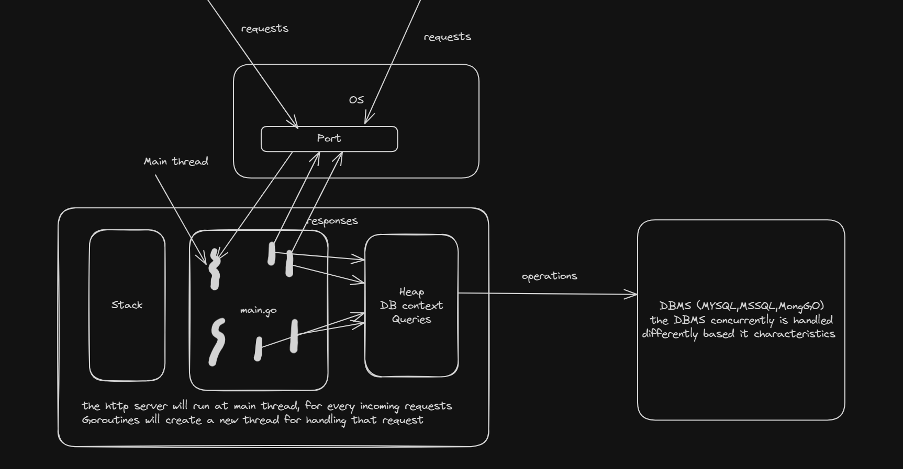

# Learning Go

## Behind the Scenes of a Go HTTP Server

Imagine you're building a web server with Go. Here's a simplified breakdown of what happens when you run it:

**Startup:**

1. **`main` Function:** Your journey begins in the `main` function. This function acts as the entry point for your program.
2. **Memory Allocation:** The code you write gets loaded into stack memory (for function calls and local variables). Additionally, any resources your application needs (like database connections or file handles) are allocated in heap memory (managed by the Go runtime).
3. **Listening for Requests:** The `http.ListenAndServe` function (or a framework like Gin that builds on top of it) takes center stage. It's like opening a door on your server, ready to listen for incoming HTTP requests on a specific port (usually port 80 for HTTP or 443 for HTTPS).

**Handling Requests:**

1. **Connections and Goroutines:** When a client (like a web browser) sends a request, a new connection (`net.Conn`) is established. To handle this request concurrently (without blocking other requests), a lightweight thread called a goroutine is created. Think of goroutines as mini workers that can handle multiple requests simultaneously.
2. **Request Processing:** The created goroutine takes charge of processing the request. It examines the request path and uses your defined handler functions to handle the request logic (e.g., fetching data from a database, rendering a web page).
3. **Response Generation:** Once processing is complete, the goroutine generates a response object containing the data or status code to send back to the client.
**Sending the Response:**

**Same Port, Different Journey:** The response is sent back to the client through the same port the request arrived on. The OS manages this behind the scenes, ensuring the response reaches the correct client.
**Key Points:**

1. Go's concurrency feature (goroutines) allows efficient handling of multiple requests at once.
2. The `http.ListenAndServe` function (or frameworks like Gin) is the core for listening and responding to HTTP requests.
3. Memory management (stack and heap) is handled by the Go runtime.



## Code Example

```go
package main

import (
    "log"
    "net"
    "net/http"
)

func main() {
    addr := ":8080"
    listener, err := net.Listen("tcp", addr)
    if err != nil {
        log.Fatalf("Failed to listen: %v", err)
    }

    for {
        // Accept new connection
        conn, err := listener.Accept()
        if err != nil {
            log.Printf("Failed to accept connection: %v", err)
            continue
        }

        // Handle the connection in a new goroutine
        go handleConnection(conn)
    }
}

func handleConnection(conn net.Conn) {
    defer conn.Close()
    
    // Create a new HTTP server connection
    server := &http.Server{}
    
    // Serve the connection
    server.Serve(&singleConnListener{conn})
}

// singleConnListener is a helper to wrap a net.Conn as a net.Listener
type singleConnListener struct {
    net.Conn
}

func (ln *singleConnListener) Accept() (net.Conn, error) {
    return ln.Conn, nil
}

func (ln *singleConnListener) Close() error {
    return ln.Conn.Close()
}

func (ln *singleConnListener) Addr() net.Addr {
    return ln.Conn.LocalAddr()
}
```

## Go Concurrency

**Concurrency vs. Parallelism:**

- **Concurrency:** This refers to the ability to handle multiple tasks seemingly at the same time. In Go, this is achieved through goroutines. Even on a single core system, the Go runtime can rapidly switch between goroutines, giving the illusion of parallel execution.
- **Parallelism:** This refers to the true simultaneous execution of multiple tasks on separate processing units (cores). While Go allows for concurrency that can leverage multiple cores, it's not perfect parallelism due to the scheduling mechanism.

**Goroutines and Concurrency:**

- **Lightweight:** Goroutines are lightweight threads that don't incur the same overhead as real threads. This allows for creating a large number of goroutines to handle tasks concurrently.
- **Cooperative Scheduling:** The Go runtime schedules goroutines to run on a pool of OS threads. When a goroutine performs blocking operations (like waiting for I/O), it yields control, allowing the runtime to schedule other waiting goroutines.

**Achieving Concurrency:**

1. **Launch Goroutines:** Use the go keyword before a function to launch it as a goroutine. Each launched goroutine runs concurrently with the main thread or other goroutines.
2. **Synchronization:** Since goroutines share memory, use synchronization mechanisms like channels or mutexes to coordinate access and avoid data races (unexpected behavior due to concurrent access).

**Limitations to Perfect Parallelism:**

1. **OS Thread Pool:** The number of goroutines that can truly run in parallel is limited by the number of available OS threads. If there are more goroutines than threads, the runtime resorts to context switching between them on a single thread, reducing efficiency.
2. **Blocking Operations:** When a goroutine performs a blocking operation (like waiting for network I/O), it holds onto the OS thread, preventing other goroutines from running on it until the operation completes. This can limit true parallelism.\

In summary, Go allows for efficient concurrency through goroutines, but it's not perfect parallelism due to the scheduling mechanism and limitations of underlying hardware. However, for many tasks, the concurrency achieved with goroutines provides significant performance benefits over traditional single-threaded execution.